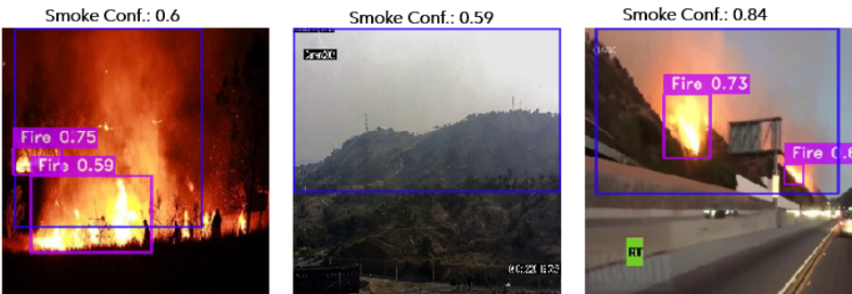
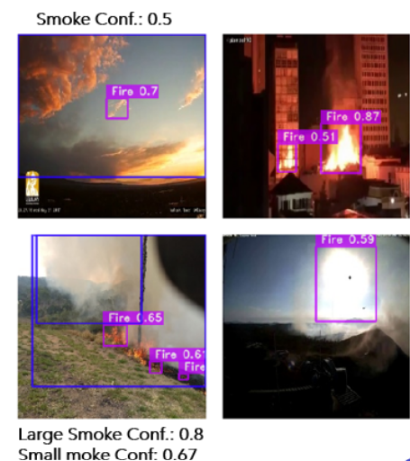

# Fire&smoke Detection

Wildfires serve as a stark reminder of nature’s raw power, often resulting in ecological
devastation, displacement of wildlife and property damage. Large-scale
fires have a huge impact on human civilization either economically, environmentally,
or health-wise and, with the increase of the global warming crisis, it
is becoming a growing problem in a large number of countries. The project’s main objective consists of using high-resolution images taken
of regions (rural and urban) that are possibly being affected by a fire and trying
to detect if there is any smoke and/or fire in the image while also predicting the
region of the image that has them. To complete the task at hand it’s
being proposed the usage of a state-of-the-art YOLO-NAS model for object detection. Recognizing a lot more work has to be done before the model becomes production ready this serves as an introductory attempt to use deep learning as a preventive wildfire intervention tool. 

## Data in use

The data set was obtained using the GitHub repository [DFireDataset1](https://github.com/gaiasd/DFireDataset). 
The data set was obtained using the GitHub repository DFireDataset1. It consists
of 21527 labeled images with smoke and/or fire and also some images with
none of those. The images in the data set consist of images from high viewpoints
(top of a building), close photos, urban environments, rural environments, artificially
made images (e.g. by adding smoke to an image), and many more
examples.

## Project Description 
This repository includes two notebooks. One includes the data visualization process. This allows one to understand the data better and see possible
images that may impact some technical decisions further in the project. It also permitted us to learn important patterns in the data. The second notebook describes the data augmentation process and the training and evaluation process. This second notebook sometimes seems to not be available for previsualization in GitHub, so please if you are having trouble with it try to download the file. 
The evaluation metrics achieved promising results but there is still some fine-tuning needed to be done to solve a false positive issue. Also, some more analysis of each class's performance may be needed.  

The metrics obtained during the evaluation of the model in the test set can be found below. 

| Metric                                                | Score | 
| --------------------------------------------------- | ---------- | 
|               mAP@0.5                               |   0.66     |   
|               precision@0.5                         |   0.039    |         
|               recall@0.5                            |   0.95     | 

### Predictions Examples
Below we can see an example of some good predictions the model was able to output. 

It's also important to note some not-so-good predictions. 

